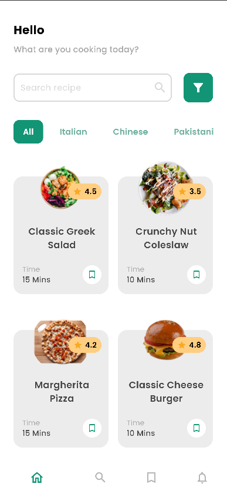
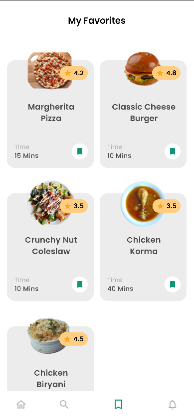
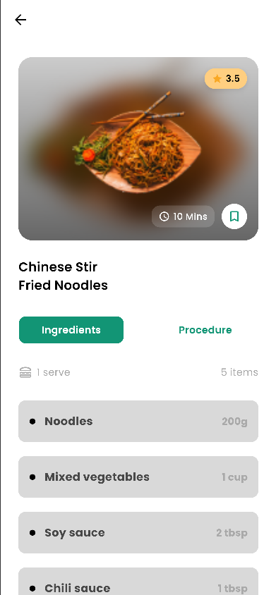
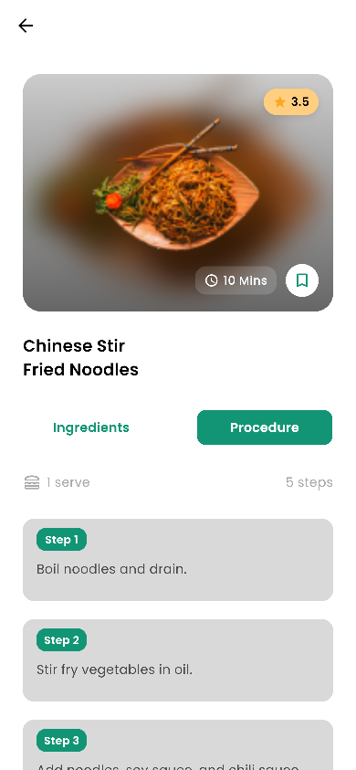

# Cookify – Flutter Recipe App

Cookify is a Flutter-based mobile application that allows users to browse recipes, view detailed cooking steps, and save their favorite dishes.

---

## Features

- **Recipe List** -E xplore a variety of recipes.
- **Search Functionality** - Find recipes by name & category.
- **Filter Functionality** - Filter recipes by category.
- **Recipe Details** – View ingredients, cooking steps, and full images.
- **Favorites** - Save and manage your favorite recipes using Provider.
- **Modern UI** - Clean and responsive design.

## Screenshots

