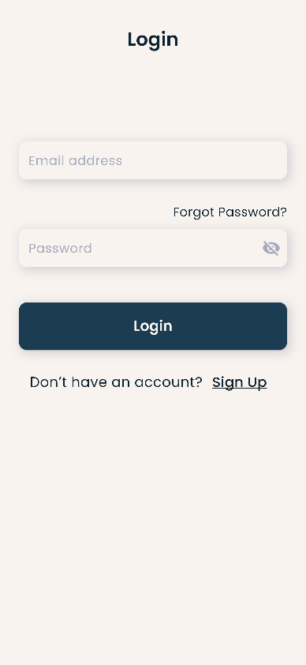

# Daily Expense Tracker (UI Only)

A Flutter UI app for tracking daily expenses, created during the **Internship Pakistan Summer Virtual Internship 2025**. This project focuses on a **clean, modern, and responsive UI** to record daily expenses effortlessly.

⚠️ **Note:** This is a UI-only project. **No backend or API integration** is included.

---

## Features

### Splash Screen
- App logo and title.
- “Internship Pakistan” text at the bottom.

### Onboarding Screens
- 2–3 slides introducing app features:
  - "Track your expenses easily"
  - "Manage your budget smartly"
  - "Start your financial journey"

### Login / Sign-Up Screen
- Email & password fields.
- Navigation links for Login / Sign-Up.

### Home Screen
- **Total Balance Card** with Income & Expense sections.
- **Recent Expenses List** (dummy data).
- **Floating Action Button (FAB)** for adding expenses.

### Add Expense Screen
- Input fields for:
  - Expense title
  - Amount
  - Date picker (UI only)
- Save button (UI only)

### Expense Details Screen
- Displays:
  - Title
  - Amount
  - Date
  - Notes
- Back button to return to Home Screen.

---

## Screenshots

| Splash Screen | Onboarding Screen | Login Screen |
|---------------|-----------------|--------------|
|  |  |  |

| Home Screen | Add Expense Screen | Expense Details Screen |
|-------------|-----------------|----------------------|
|  |  |  |

---

## Dependencies

- [flutter](https://flutter.dev/)
- [google_fonts](https://pub.dev/packages/google_fonts)
- [intl](https://pub.dev/packages/intl)
- [smooth_page_indicator](https://pub.dev/packages/smooth_page_indicator)
