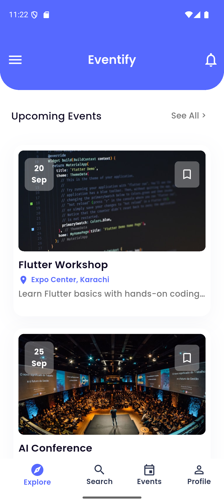
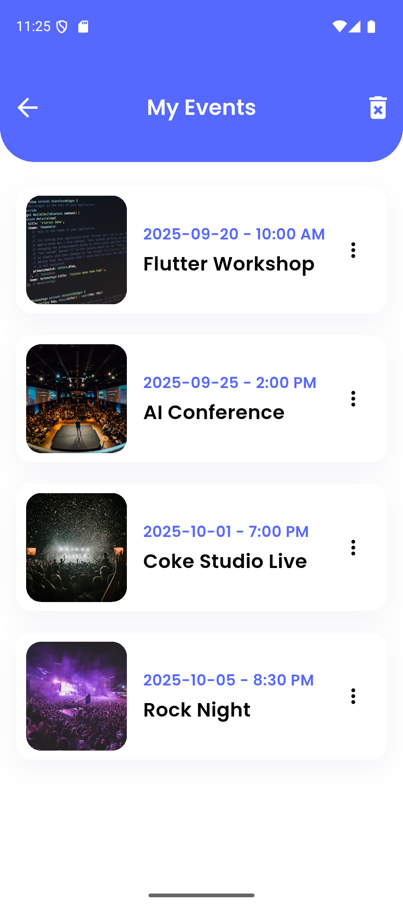
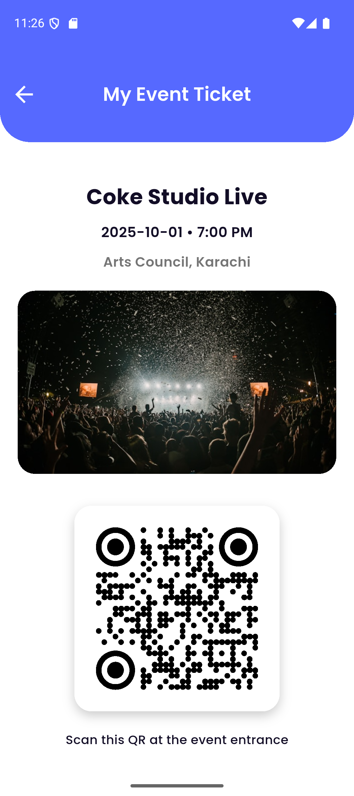

# Mini Event Registration App (Eventify)  

A Flutter-based **Event Registration Application** built as part of the **Flutter Development Internship (Week 05–06 Task)**.  
This app allows users to explore events & search events, view details, register, and generate QR tickets with a clean and responsive UI.  

---

## Features  

### Authentication  
- **Firebase Login & Signup** implemented for user access.  

### Home Screen  
- Displays a list of upcoming events (dummy data).  
- Each event shows **title, date, location, and short description**.  

### Event Details Screen  
- Shows full event details:  
  - Title  
  - Description  
  - Date & Time  
  - Location  
  - Image  
- **Register Button** to save event to local storage.  
- **Bookmark Icon** to favorite and unfavorite events. 

### Registration System  
- When a user registers, the event is stored locally.  
- A **My Events Screen** lists all registered events.  

### Extra Features  
- **Search & Filter**: Easily find events by name or date.
- **QR Code Generation**: Each registered event generates a unique QR ticket using `qr_flutter`.  
- **Premium Ticket Screen**: Displays event details and a stylish QR code for entry.  
- **Responsive UI**: Optimized for different screen sizes using MediaQuery.  
- **Consistent Design**: Google Fonts, smooth layouts, and custom colors.  

---

## Tech Stack  

- **Flutter (Dart)** – Frontend  
- **Firebase Authentication** – Login & Signup 
- **Hive** – Local Storage (for event registrations)  
- **qr_flutter** – QR Code generation  
- **Google Fonts** – Clean typography  
- **Firebase** – Authentication integration  

### Screenshots

