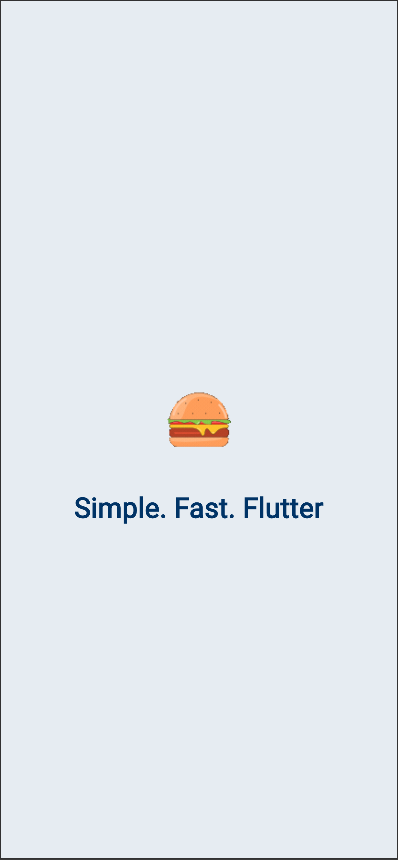
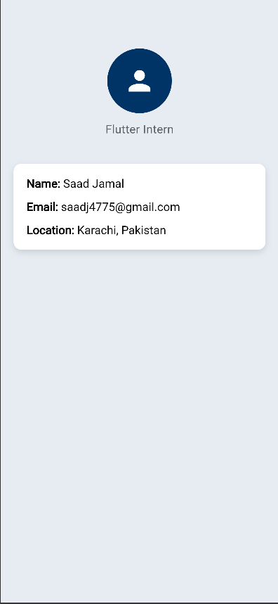
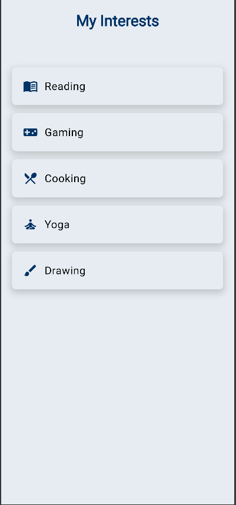
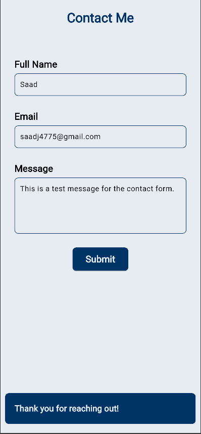

# MyFirstFlutterApp

This is a Flutter project developed during **Week 1** of the [Internship Pakistan – Flutter Development Summer Internship 2025]. The goal was to create 4 individual UI screens to demonstrate layout, styling, and widget usage in Flutter.

---

## Screens Implemented

### 1. Splash Screen
- Welcome screen with app name and centered layout.
- Styled using custom colors and typography.

### 2. Profile Screen
- Displays personal profile details:
  - Name
  - Email
  - Location
- Includes avatar and styled text using `RichText`.

### 3. Interests List
- A list of hobbies/interests:
  - Reading 📚
  - Gaming 🎮
  - Cooking 🍳
  - Yoga 🧘‍♂️
  - Drawing 🎨
- Built using `ListView` and `ListTile`.

### 4. Contact Form
- Form fields: Name, Email, Message.
- Validation added for empty fields.
- Submit button displays a success snackbar.

---

### Preview

